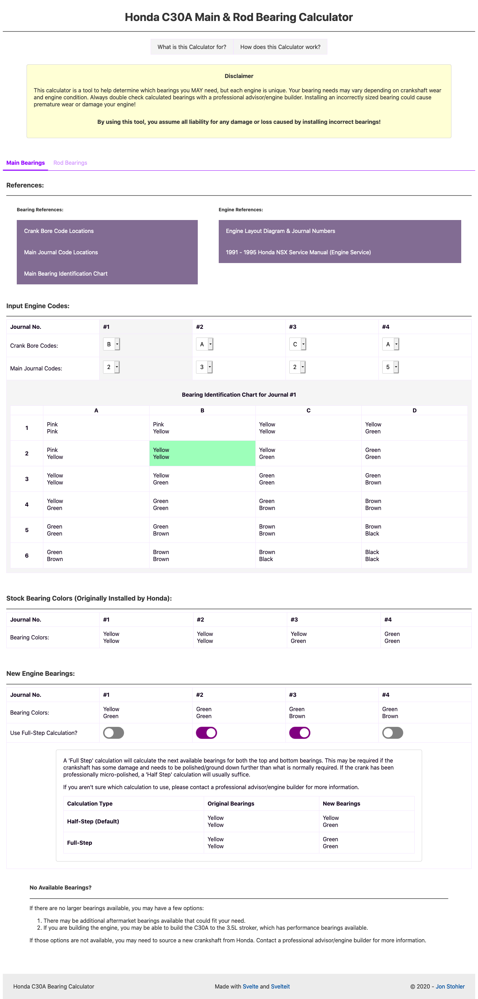

# Honda C30A Main & Rod Bearing Calculator

:boom: **[View the Calculator HERE](https://jstohler.github.io/c30a-engine-bearing-calculator/)** :boom:

This is a calculator used to determine which Main Bearings and Rod Bearings to purchase and install when rebuilding a Honda C30A engine. 

Selecting these bearings was easily the most difficult part during the rebuild of my 1991 NSX. The NSX Service manual doesn't describe the process of determing which bearings to choose when rebuilding the engine, only identifying which bearings were originally installed. I searched online to see if there was any easier process of determining which bearings to use and couldn't find a clear explaination.

I created this calculator to make the bearing selection process easier for anyone who is rebuilding their C30A.

### Preview:



## Language Choice and Project Background

I created this project to learn more about modern frontend languages and architecture in my spare time. By trade, I'm primarily a backend engineer that works with Python, Java, Web Frameworks, and lower level languages. I've heard a lot about Svelte via friends and colleagues and decided to learn more about it once I ran into this issue during my engine rebuild. 

Svelte worked very well with helping me build out this calculator to solve the engine bearing problem. Everything was very straightforward to setup, and after reading through the documentations and a few examples on [svelte.dev](https://svelte.dev), it only took me a few hours over a weekend to build this project. 

I would highly recommend it to anyone looking to build a fast frontend project. Not only does this project only take up 15MB in size (compared to 400MB with React), it was much simpler to use, must faster to run, and very easy to get into!


## Installation and Build

This project is built using Svelte and Rollup using NPM, so installing and building is an easy 3 step process!

1. Install the dependencies via NPM:
    ```bash
    cd c30a-engine-bearing-calculator
    npm install
    ```

2. Start the app via Rollup:
    ```bash
    npm run dev
    ```

3. The site will be live locally at [localhost:5000](http://localhost:5000).


### To create a deployable build of the app:

```bash
npm run build
```

You can run the newly built app with `npm run start`. This uses [sirv](https://github.com/lukeed/sirv), which is included in your package.json's `dependencies` so that the app will work when you deploy to platforms like [Heroku](https://heroku.com).


## Roadmap
- Improve support for mobile resolutions.
- Allow the user to perform 'full-step' calculations by each individual journal.


## License
[MIT](https://choosealicense.com/licenses/mit/)